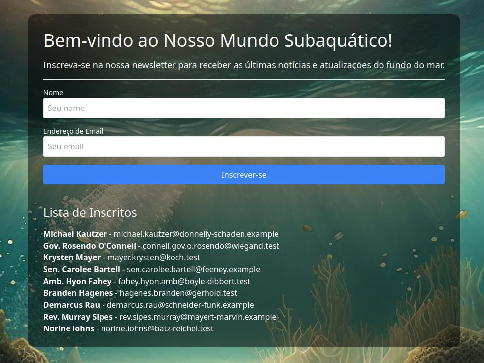

# SEA Landing Page
## Developed with Ruby + React

Simple landing page with back-end developed in Ruby and front-end developed with React. Newsletter user data is saved in a json file. 

Simples landing page com back-end desenvolvido em Ruby e front-end desenvolvido com o React. Os dados usuários da Newsletter são salvos num arquivo json. 

### English instructions 

#### Running the application 

To run the app you need to have Ruby, Node.js/NPM and React installed and configured. 

To run the back-end, enter the 'email-pickup' directory, install the dependencies with the `bundle install` command and use the `ruby app.rb` command to run the application. 

To run the front-end, enter the front directory, install the dependencies with NPM and run the `npm start` command. View the app in the browser at the url 'http://localhost:3000' 

##### Running with Docker 
In the project root, run the `docker-compose up` command. View the app in the browser at the url 'http://localhost:3000'

#### Backend commands to use in the terminal 
In the email-pickup directory you can use the commands below: 
`ruby populate_users_file.rb` to create 100 users in the newsletter 
`ruby remove_all_contacts.rb` remove all contacts 
`ruby remove_duplicates.rb` remove all duplicate contacts 

### Instruções em Português 

#### Rodando a aplicação 

Para rodar o app é necessário ter o Ruby, Node.js/NPM e React instalados e configurados. 

Para rodar o back-end, entre no diretório 'email-pickup', instale as dependências com o comando `bundle install` e use o comando `ruby app.rb` para rodar a aplicação. 

Para rodar o front-end entre no diretório front, instale as dependências com o NPM e execute o comando `npm start`. Vizualise o app no browser na url 'http://localhost:3000' 

##### Rodando com o Docker 
Na raiz do projeto execute o comando `docker-compose up`. Vizualise o app no browser na url 'http://localhost:3000' 

#### Comandos do back-end para usar no terminal 
No diretório `email-pickup` você poderá usar os comandos abaixo: 
`ruby populate_users_file.rb` para criar 100 usuários na newsletter 
`ruby remove_all_contacts.rb` remover todos os contatos 
`ruby remove_duplicates.rb` remover todos os contatos duplicados 